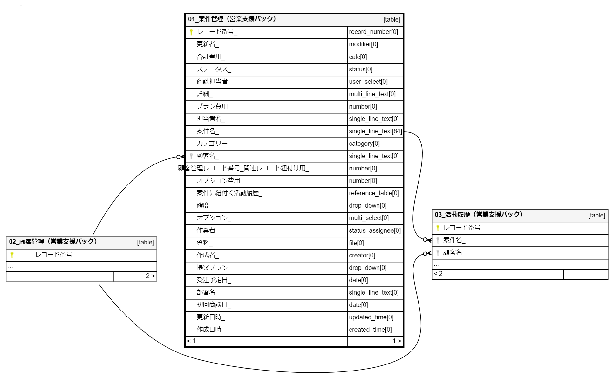

# kintone-metadata-jdbc-driver 

## Introduction
[kintone driver](https://kintone.cybozu.co.jp/) for [SchemaSpy](http://schemaspy.sourceforge.net/)

* kintoneのアプリ情報・項目情報・ER図(Lookup項目を外部キー項目として表示)を、SchemaSpyを利用してHTML出力 
* 制限として、ER図に関連レコード一覧（REFERENCE_TABLE）の関係性は表示していません。
-----

An example diagram:

ref doc
* [kintone columns](https://developer.cybozu.io/hc/ja/articles/202166330-%E3%83%95%E3%82%A3%E3%83%BC%E3%83%AB%E3%83%89%E5%BD%A2%E5%BC%8F) 